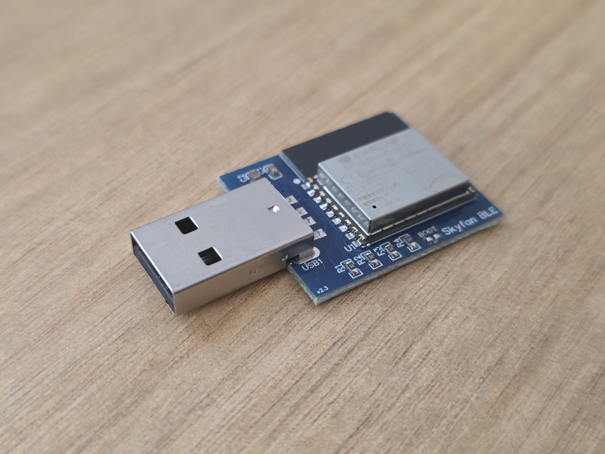

# Skyfan BLE

An ESPHome‑based ESP32‑C3 controller for local Home Assistant control of Ventair Skyfan ceiling fans.
It provides reliable local control of the fan and light, plus optional BLE features such as room presence or BLE proxy.

**This project is not affiliated with or supported by Ventair**.
It replaces the Tuya SKYAPPCM module and works with Home Assistant only — not the Tuya Smart Life app.

## Hardware
You can build your own board using the provided [schematics](images/Schematic_Skyfan-DC-BLE-v2.3.png), or use a pre‑made SkyfanBLE board.

>[!WARNING]
>Do not plug this board into a computer USB port.
>The USB connector feeds voltage directly into the ESP32 and will destroy it. Make sure you feed it 3.3V.

To manually power the board, use a power supply that outputs 3.3V.
BOOT pads are provided for manual flashing with a USB‑to‑UART adaptor.

## Installation (using a pre‑made SkyfanBLE board)
SkyfanBLE ships with base firmware installed.
If you have Bluetooth enabled in Home Assistant, the device will be discovered automatically via BLE Improv.

The board also broadcasts a Wi‑Fi setup network named **skyfan_xxxxx** (using the last part of the MAC address).
You can join this network to enter your Wi‑Fi credentials manually. Default password is **12345678**

If you want to flash your own ESPHome firmware, short the BOOT pads while powering the board to enter bootloader mode.
You can do this with a small blob of solder or by holding a tool across the pads during power‑up.

## Entity and Tuya Datapoint (DP) Mapping
Base YAML is published **[here](SkyfanBLE.yaml)**.
It uses standard ESPHome Tuya platforms and simple Select entities for additional controls

### Light (Tuya Dimmer)
The Skyfan light is implemented using the ESPHome Tuya Dimmer platform:

- **Switch (On/Off)** — DP15

- **Brightness** — DP16  
  - Mapped using `min_value` and `max_value` to match the MCU’s expected range  
  
- **Colour Temperature** — DP19  
  - Implemented as a **select** with three fixed options  

### Fan (Tuya Fan)
The fan entity uses the native Tuya Fan platform.

- **Switch (On/Off)** — DP1  
- **Speed** — DP3  
- **Direction** — DP8  

### Additional Controls
These are implemented as select entities:

- **Fan Mode** — DP2  
- **Fan Timer** — DP22  

## Acknowledgements
This project would not exist without **[Jimmy James work](https://github.com/jeggleston1981/skyfandc/tree/main)**, who mapped and documented the Skyfan datapoints and shared his findings openly.

Other community projects have also explored Skyfan control with additional features and ideas.

## Tested On
- **Ventair Skyfan DC** — confirmed working

If you test this on other models, please submit a PR or open an issue so we can expand compatibility.

## License
MIT License — see `LICENSE` for details.